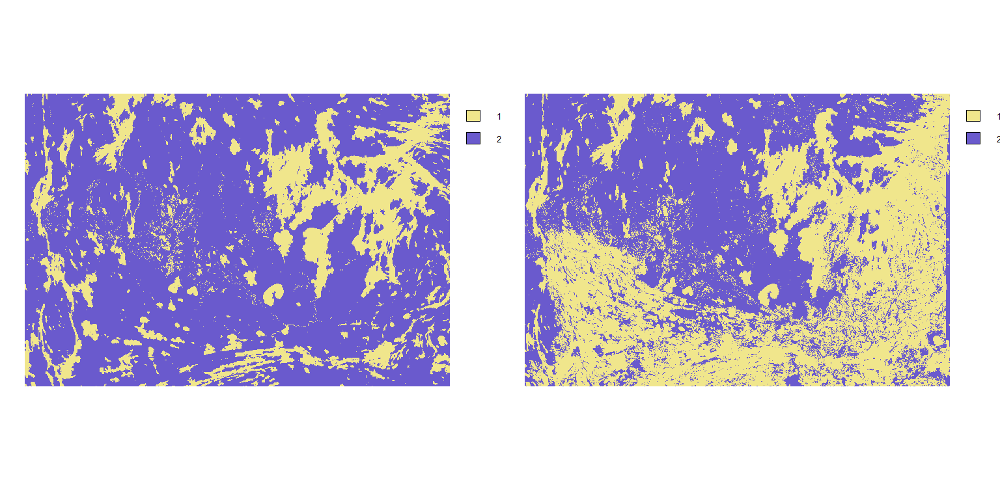
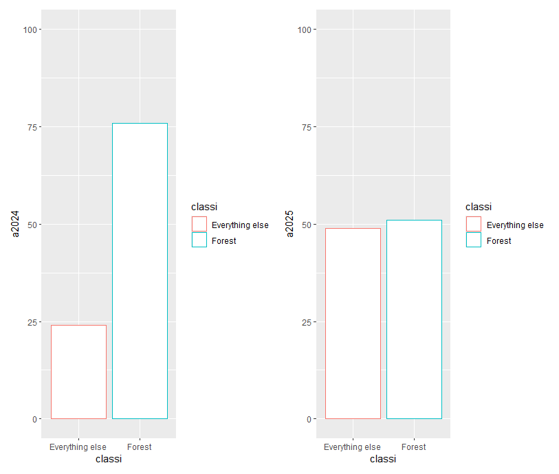
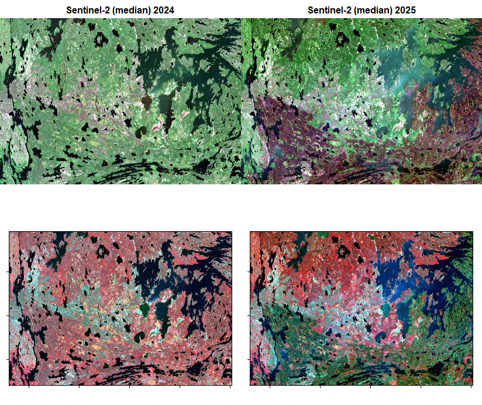
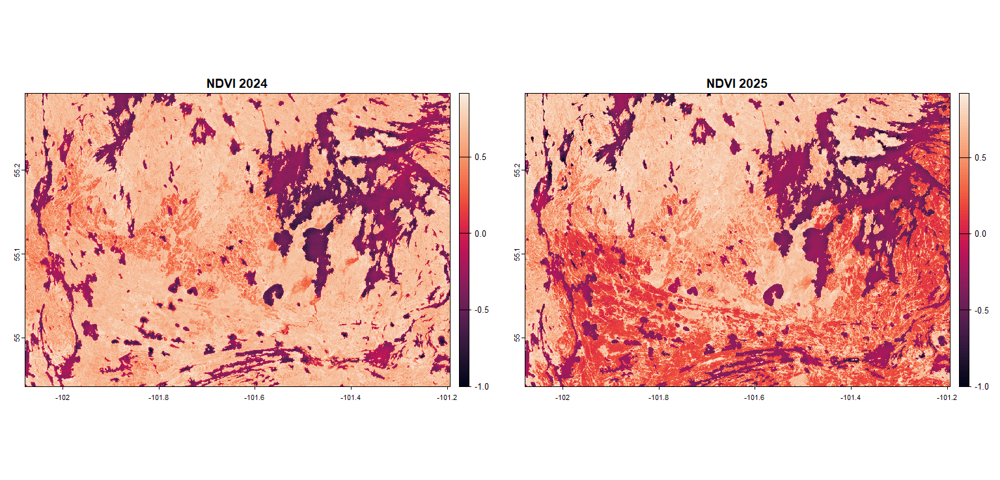
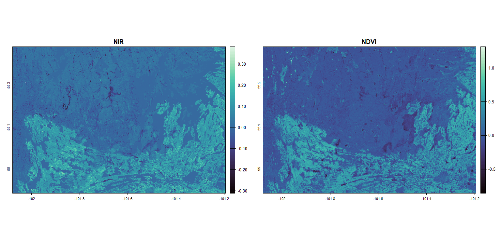

## **Progetto d'esame (09/07/2025)**
# Analisi di un'area canadese soggetta a incendio nella primavera 2025
### Telerilevamento geologico in R
Greta Marchisotti

---

## Introduzione
Il progetto ha lo scopo di analizzare un'area del Canada, al confine tra le regioni Manitoba e Saskatchewan, a nord della cittadina Flin Flon, che nella primavera del 2025 è stata oggetto di un ampio incendio.

L'analisi vuole osservare le differenze in termini di vegetazione tra il 2024 e il 2025 e valutare quindi l'impatto dell'incendio stesso.

Sono state pertanto scelte due immagini di Sentinel-2, che riguardano giugno 2024 e giugno 2025.

## Raccolta delle immagini
Le immagini sono state scaricate attraverso il sito web di [Google Earth Engine](https://earthengine.google.com/), scegliendo l'area descritta precedentemente.

> [!NOTE]
>
> Il codice completo in java script utilizzato per ottenere le immagini si trova nel file Codice_js_GM.js

## Pacchetti utilizzati
I pacchetti di R che sono stati utilizzati per questo codice sono i seguenti:
```r
library(terra) # Pacchetto per l'analisi spaziale dei dati con vettori e dati raster
library(imageRy) # Pacchetto per manipolare, visualizzare ed esportare immagini raster in R
library(viridis) # Pacchetto per cambiare le palette di colori anche per chi è affetto da colorblindness
library(ggplot2) # Pacchetto per creare grafici ggplot
library(patchwork) # Pacchetto utilizzato per comporre più grafici ggplot insieme
```

## Impostazione della working directory e importazione delle immagini
```r
setwd("C:/Users/march/Desktop/BOLOGNA/II semestre/Telerilevamento geoecologico in R/ESAME")

sentinel2024 <- rast("Canada2024.tif")
sentinel2025 <- rast("Canada2025.tif")
```

> [!NOTE]
>
> Il raster sentinel2024 corrisponde ai dati di giugno 2024, mentre sentinel2025 riguarda i dati di giugno 2025.

Le immagini importate sono state poi visualizzate nello spettro del visibile, creando un pannello multiframe per permettere un migliore confronto.
```r
im.multiframe(1,2)
plotRGB(sentinel2024, r = 1, g = 2, b = 3, stretch = "lin", main = "Sentinel-2 (median) 2024")
plotRGB(sentinel2025, r = 1, g = 2, b = 3, stretch = "lin", main = "Sentinel-2 (median) 2025")
```

L'immagine risultante è la seguente:


> **Commento**
>
> L'immagine mostra chiaramente l'area soggetta a incendio, che corrisponde alla porzione inferiore dell'immagine di sinistra.

---

## Analisi dei dati
### Classificazione delle immagini
Le immagini sono state classificate in due classi corrispondenti all'area coperta da vegetazione e tutta la restante area, composta principalmente da laghi, suolo nudo e dall'area dell'incendio nell'immagine del 2025.

Per fare ciò, è stato innanzitutto aperto un pannello multiframe per permette la visualizzazione delle immagini insieme, ed è stata poi utilizzata la funzione ```im.classify()``` di imageRy, creata appositamente per questo tipo di classificazioni.

```r
im.multiframe(1,2)
sentinel2024_cl = im.classify(sentinel2024, num_clusters=2)
sentinel2025_cl = im.classify(sentinel2025, num_clusters=2)
```

Di seguito si riporta l'immagine ottenuta:
 

> **Commento**
>
> In blu si osserva l'area vegetata (class 2: Forest), mentre in giallo (class 1: Everything else) tutto ciò che non è vegetazione.
>
> Notiamo come nell'immagine di sinistra, che corrisponde al 2025, la percentuale di pixel appartenenti alla classe 1 (Everything else) sono notevolmente aumentati, a causa dell'incendio.

Questo si può osservare anche calcolando la percentuale delle due classi nelle immagini:
```r
perc2024 = freq(sentinel2024_cl)*100/ncell(sentinel2024_cl)
perc2024 # Forest: 76%, Everything else: 24%

perc2025 = freq(sentinel2025_cl)*100/ncell(sentinel2025_cl)
perc2025 # Forest: 51%, Everything else: 49%
```
> I risultati mostrano come la percentuale di foresta sia scesa dal 76% al 51% dal 2024 al 2025 a causa dell'incendio.

È stato quindi creato un grafico con la funzione ```ggplot()``` per visualizzare graficamente questa differenza: per fare ciò è stato necessario prima creare un dataframe con i valori necessari; i due grafici sono poi stati plottati uno di fianco all'altro.
```r
classi = c("Forest", "Everything else")
a2024 = c(76,24)
a2025 = c(51,49)
tab = data.frame(classi, a2024, a2025)
```

Si riportano i risultati in una tabella:

| Classe | 2024 | 2025 |
|--- |--- |--- |
|   1: Everything else |  24%  |  49%  |
|   2: Forest |76% |51% |

```r
p1 = ggplot(tab, aes(x=classi, y=a2024, fill=classi, color=classi)) + geom_bar(stat="identity", fill="white") + ylim(c(0,100))
p2 = ggplot(tab, aes(x=classi, y=a2025, fill=classi, color=classi)) + geom_bar(stat="identity", fill="white") + ylim(c(0,100))
p1 + p2
```

Il grafico è il seguente:

 

### Visualizzazione delle bande
È stato creato un grafico per mostrare le differenti bande scelte per le immagini: la banda 4 corrisponde al colore rosso, la banda 3 al verde, la banda 2 al blu e la banda 8 all'infrarosso vicino (NIR); per i grafici è stata scelta la palette di viridis chiamata magma.

> [!NOTE]
>
> Questo è possibile perchè Sentinel-2, essendo un satellite, acquisisce le immagini per bande: possiamo quindi visualizzarle in modo combinato, per esempio per mostrare un'immagine con i colori reali, oppure separatamente come in questo caso.

```r
plot(sentinel2024, main=c("B4-Red", "B3-Green", "B2-Blue", "B8-NIR"), col=magma(100))
plot(sentinel2025, main=c("B4-Red", "B3-Green", "B2-Blue", "B8-NIR"), col=magma(100))
```

Per quanto riguarda il 2024, il risultato è il seguente:
 

Per quanto riguarda il 2025, invece, il risultato è:


> **Commento**
> 
>  Da entrambe le immagini si può notare come, mentre le bande 4, 3 e 2 sono abbastanza simili tra loro, la banda 8, e cioè il NIR, risulta essere molto diversa: è infatti la banda che ci permette di visualizzare al meglio la vegetazione.
> 
> Se la vegetazione è sana, la riflettanza sarà maggiore nell'infrarosso vicino (NIR); viceversa, se la vegetazione è sottoposta a stress, come un incendio,  la riflettanza del NIR diminuisce: i valori del NIR del 2025 sono, infatti, molto più bassi nell'area soggetta a incendio.

È stato poi scelto di visualizzare le immagini con il NIR, ponendo la banda 8 al posto della banda del rosso e plottando le immagini in un pannello multiframe, insieme a quelle visualizzate nello spettro del visibile. Il codice è il seguente: 
```r
im.multiframe(2,2)
plotRGB(sentinel2024, r = 1, g = 2, b = 3, stretch = "lin", main = "Sentinel-2 (median) 2024")
plotRGB(sentinel2025, r = 1, g = 2, b = 3, stretch = "lin", main = "Sentinel-2 (median) 2025")
im.plotRGB(sentinel2024, r=4, g=1, b=3)
im.plotRGB(sentinel2025, r=4, g=1, b=3)
```

Si ottiene in questo modo l'immagine riportata qui di seguito:


> **Commento**
> 
> Le immagini in basso sono quelle in cui è visualizzata la banda del NIR che, essendo stata inserita al posto della banda red, permette di visualizzare la vegetazione in rosso. Questa banda è infatti la più indicata per visualizzare la vegetazione e le diverse sfumature di rosso corrispondono a diverse tipologie di vegetazione. Il suolo nudo appare invece in azzurro chiaro.

### Indici spettrali: NDVI
Il *Normalized Difference Vegetation Index* (NDVI) è un indice utilizzato per la vegetazione dato dalla differenza tra la riflettanza nel NIR e la riflettanza nel red, che è stato standardizzato, in modo che sia svincolato dalla risoluzione delle immagini e quindi in modo che il range vada sempre da +1 a -1, a prescindere dal numero di bit dell’immagine.

Siccome la vegetazione sana riflette molto nell'infrarosso vicino e poco nel rosso, il suo NDVI avrà valori molto alti; viceversa, la vegetazione stressata avrà una riflettanza minore nel NIR e maggiore nel rosso e quindi il suo NDVI sarà più basso.

Il codice per calcolare l'NDVI nelle immagini è il seguente:
```r
ndvi2024 = im.ndvi(sentinel2024, 4, 1)
ndvi2025 = im.ndvi(sentinel2025, 4, 1)

im.multiframe(1,2)
plot(ndvi2024, col=rocket(100), main="NDVI 2024")
plot(ndvi2025, col=rocket(100), main="NDVI 2025")
```

L'immagine che si ottiene è la seguente:

 

> **Commento**
>
> Come ci si aspettava da quanto detto precedentemente, l'NDVI ha valori più bassi nell'area soggetta a incendio, rispetto alla stessa area del 2024.

### Analisi multitemporale
Facendo un'analisi multitemporale è poi possibile confrontare le differenze tra l'immagine del 2024 e quella del 2025: in questo caso, è stato scelto di confrontare le due immagini per quanto riguarda la banda del NIR e l'NDVI, per evidenziare le differenze relative in particolare alla vegetazione.

Le due immagini finali sono state plottate insieme in un pannello multiframe.

```r
nir_diff = sentinel2024[[4]]-sentinel2025[[4]]
ndvi_diff = ndvi2024-ndvi2025

im.multiframe(1,2)
plot(nir_diff, col=mako(100), main="NIR")
plot(ndvi_diff, col=mako(100), main="NDVI")
```
> [!NOTE]
>
> Il file nir_diff rappresenta la differenza tra la banda del NIR del 2024 e del 2025, mentre il file ndvi_diff è dato dalla differenza dell'NDVI per il 2024 e il 2025.


Il risultato è il seguente:
 

> **Commento**
>
> Osserviamo come la differenza è maggiore nell'area soggetta a incendio sia per quanto riguarda la banda del NIR che per quanto riguarda l'NDVI, mentre il resto dell'area è rimasta pressochè uguale.
>
> Valori negativi rappresentano zone di aumento della vegetazione; viceversa, valori positivi indicano zone di diminuzione della vegetazione.

---

## Conclusioni
+ L'area soggetta a incendio mostra una forte diminuzione della copertura vegetativa, come visto dal valore dell'NDVI e dalla differenza nella riflettanza nell'infrarosso vicino.
+ Le immagini qui analizzate riguardano solo una piccola porzione di tutta l'area che è stata impattata dagli incendi della primavera 2025: per un'analisi su più larga scala è necessario scaricare immagini complete di tutte le regioni di Manitoba e Saskatchewan.
+ Queste aree sono soggette a incendi annuali: un ulteriore sviluppo di queste analisi potrebbe riguardare il confronto dell'impatto degli incendi nei vari anni e non solo di quelli del 2025.
+ Il telerilevamento e l'analisi dei dati attraverso le bande di riflettanza e gli indici spettrali sono un valido strumento per analizzare i dati da satellite e valutare gli impatti che fenomeni come gli incendi possono avere su vaste aree.
