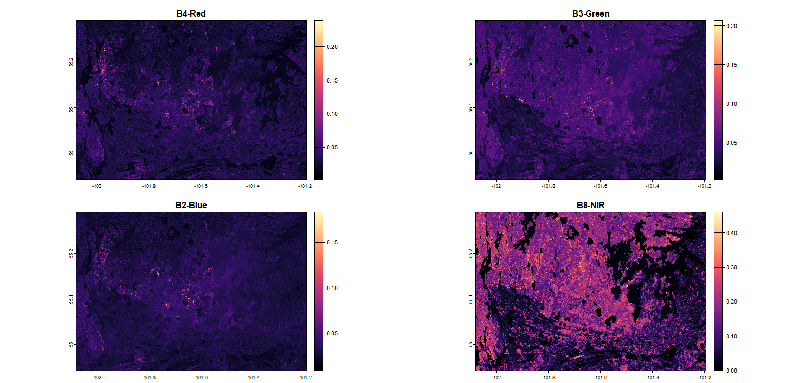

# Telerilevamento geologico in R - Progetto d'esame
# 09/07/2025
## Greta Marchisotti

Il progetto ha lo scopo di analizzare un'area del Canada, al confine tra le regioni Manitoba e Saskatchewan, a nord della cittadina Flin Flon, che nella primavera del 2025 è stata oggetto di un ampio incendio.

L'analisi vuole osservare le differenze in termini di vegetazione tra il 2024 e il 2025 e valutare quindi l'impatto dell'incendio stesso.

Sono state pertanto scelte due immagini di Sentinel-2, che riguardano una media di giugno 2024 e una media di giugno 2025.

## Raccolta delle immagini
Le immagini sono state scaricate attraverso il sito web di [Google Earth Engine](https://earthengine.google.com/), scegliendo l'area descritta precedentemente.

Il codice completo in java script utilizzato per ottenere le immagini si trova nel file Codice_js_GM.js

## Pacchetti utilizzati
I pacchetti di R che sono stati utilizzati per questo codice sono i seguenti:
```r
library(terra) # Paccheto per l'analisi spaziale dei dati con vettori e dati raster
library(imageRy) # Pacchetto per manipolare, visualizzare ed esportare immagini raster in R
library(viridis) # Pacchetto per cambiare le palette di colori anche per chi è affetto da colorblindness
library(ggplot2) # Pacchetto per creare grafici ggplot
library(patchwork) # Pacchetto per comporre più grafici ggplot insieme
```

## Impostazione della working directory e importazione delle immagini
```r
setwd("C:/Users/march/Desktop/BOLOGNA/II semestre/Telerilevamento geoecologico in R/ESAME")

sentinel2024 <- rast("Canada2024.tif")
sentinel2024

sentinel2025 <- rast("Canada2025.tif")
sentinel2025
```

Le immagini importate sono state poi visualizzate nello spettro del visibile, creando un pannello multiframe per permettere un migliore confronto.
```r
im.multiframe(1,2)
plotRGB(sentinel2024, r = 1, g = 2, b = 3, stretch = "lin", main = "Sentinel-2 (median) 2024")
plotRGB(sentinel2025, r = 1, g = 2, b = 3, stretch = "lin", main = "Sentinel-2 (median) 2025")
dev.off()
```

L'immagine risultante è la seguente:

> L'immagine mostra chiaramente l'area soggetta a incendio, che corrisponde alla porzione inferiore dell'immagine di sinistra.

È stato poi creato un grafico per mostrare le differenti bande scelte per le immagini: la banda 4 corrisponde al colore rosso, la banda 3 al verde, la banda 2 al blu e la banda 8 all'infrarosso vicino (NIR); per i grafici è state scelta la palette di viridis chiamata magma.
```r
plot(sentinel2024, main=c("B4-Red", "B3-Green", "B2-Blue", "B8-NIR"), col=magma(100))
plot(sentinel2025, main=c("B4-Red", "B3-Green", "B2-Blue", "B8-NIR"), col=magma(100))
```

Per quanto riguarda il 2024, il risultato è il seguente:
 

Per quanto riguarda il 2025, invece, il risultato è:


> Da entrambe le immagini si può notare come, mentre le bande 4, 3 e 2 sono abbastanza simili tra loro, la banda 8, e cioè il NIR risulta essere molto diversa.
> 


