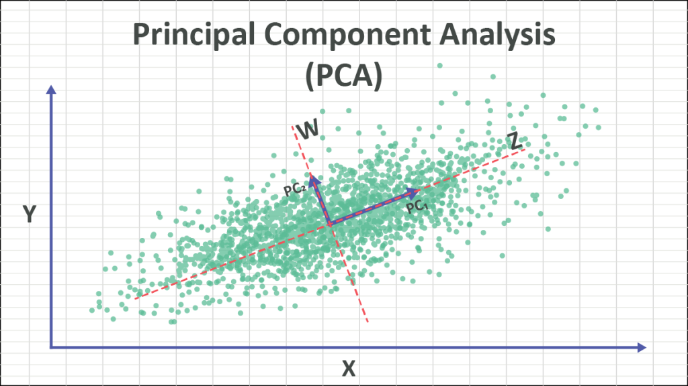

# How to perform multivariate analysis: theory

Information about theory of Principal Component Analysis can be found [here](https://numxl.com/blogs/principal-component-analysis-pca-101/).

A graphical scatch is the following:

